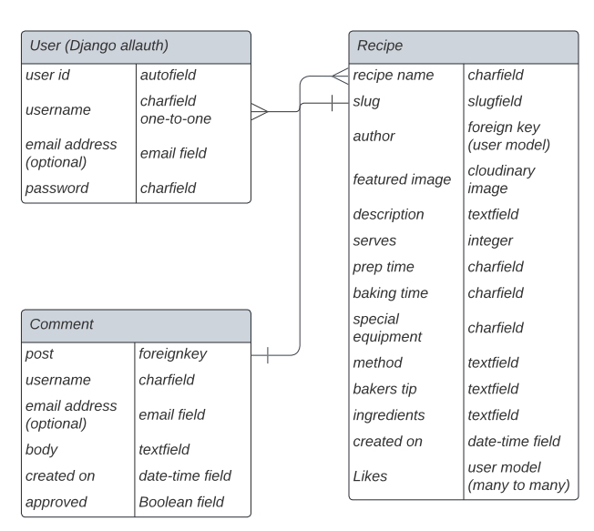

# Let's Bake!

Let's Bake is a baking blog developed using Django, Python, HTML, CSS and JavaScript.

The blog is designed to share the love of baking.  The blog provides general baking relating posts as well as recipes for visitors, which is the core purpose of the blog. 

Registered users have the option to share, edit and delete their own recipes. They can also like and comment on all posts.

[Go to blog website, Let's Bake!]()

* [User Experience (UX)](#User-Experience-(UX))
  * [User & Blog Goals](#User-&-Blog-Goals)
  * [Agile Methodology](#Agile-Methodology)
  * [Epics & User Stories](#Epics-&-User-Stories)

* [Design](#Design)
  * [Colour Scheme](#Colour-Scheme)
  * [Fonts](#Fonts)
  * [Imagery](#Imagery)
  * [Wireframes](#Wireframes)
  * [Database Model](#Database-Model)

* [Features](#Features)
  * [Future features](#Future-features)

* [Security Features & Defensive Design](#Security-Features-&-Defensive-Design)

* [Technologies Used](#Technologies-Used)
  * [Languages Used](#Languages-Used)
  * [Django](#Django)
  * [Frameworks, Libraries & Programs Used](#Frameworks,-Libraries-&-Programs-Used)

* [Testing](#Testing)

* [Deployment](#Deployment)
  * [Create the live database which can be accessed by Heroku](#create-the-live-database-which-can-be-accessed-by-heroku)
  * [Heroku app setup:](#heroku-app-setup)
  * [Prepare env.py and settings.py files](#prepare-envpy-and-settingspy-files)
  * [Create files / directories](#create-files--directories)
  * [Update Heroku Config Vars](#update-heroku-config-vars)
  * [Deploy](#deploy)
  * [Local Deployment](#Local-Deployment)
  * [Remote Deployment](#Remote-Deployment)
  * [Deploy project to Heroku](#Deploy-project-to-Heroku)
  
* [Credits](#Credits)
  * [Code](#Code)
  * [Acknowledgements](#Acknowledgements)

- - -

## User Experience (UX)

### User & Blog Goals

#### Targeted User Goals:
* A user interested in baking.
* A user who wants access to recipes.
* A user that wants a platform to share their own recipes.

#### Site User Goals:
* For users to be able to interact with the site intuitively.
* For users to be able to access and view all posts.
* For users to be able to learn recipes and baking related posts.
* For users to be able to create an account to access additional functionality.
* For registered users to be able to log in and out of their account.
* For registered users to be able to like and comment on all posts.
* For registered users to be able add, edit and delete their own recipes.

#### Blog Goals:
* Offers a platform to promote community and love for baking.
* Provide registered users the access to like, comment and share recipes with full CRUD functionality.

### Agile Methodology

This blog was developed with agile planning. Each individual user feature was split into a user story. Each user story was defined and included an acceptance criteria. The acceptance criteria were tasks to mark as complete to complete the user story. 

Related user stories achieving a certain functionality of the blog were grouped together in to Epics.

Each user story was labeled as Must Have, Should Have and Could Have to help prioritise which were most important to implement.

As the blog evolved, tasks were added or updated, based on the changing needs / understanding of the what the blog should provide the user.

This was implemented through Github Issues and the Kanban board in the projects view in Github, the project was divided into a few different sections:

* To Do - All user stories were initially entered in the 'To Do' column
* In Progress - During development stories were moved into the 'In Progress' column
* Done - On completion they get moved into the 'Done' column
* Future - Any 'could have' stories with features that I can look to implement at a later date, where due to time restraints I was unable to work on.

Please find my Kanban Board with my user stories [here](https://github.com/users/Sarohia94/projects/3/views/1).

### Epics & User Stories

**Epic 1: Website UI Features**

User Story #1

Site pagination (must have) - As a site user I can view a paginated list of posts so that easily select a post to view.

Acceptance Criteria:
* As a site user I can view 4 posts per page.
* As a site user it is easy to navigate and view posts to pick which one I want to read.

User Story #2

View post (must have) - As a site user I can view a list of posts so that I can select one to read.

Acceptance Criteria:
* As a site user, I can view posts submitted.
* As a site user, I can view the image, recipe title and short description to help choose what to read.

User Story #3

Open a post (must have) - As a site user I can click on a post so that I can read the full text.

Acceptance Criteria:
* Clicking on post opens a page where user can view the full post/recipe.

User Story #4

Search bar (could have) - As a site user I can use a search bar to search for a specific recipe so that I have quick and easy access to the information I want.

Acceptance Criteria:
* As a site user, I can easily find and navigate to the search bar.
* As a site user, I can use the search bar to search by recipe name.
* As a site user, I can view the results yielded by my search that I can click from.

**Epic 2: Registration & Account Features**

User Story #6 

Account registration (must have) - As a site user I can register an account so that I can submit my own post, comment and like.

Acceptance Criteria:
* As a site user, I intuitively know where to go to sign up.
* As a site user, I can easily register my account without issue.

User Story #7

Login & logout (must have) - As a registered user, I can login and logout of the site so that I can have access to my account.

Acceptance Criteria:
* As a registered user, I can login and out successfully.

User Story #8

Comment on a post (must have) - As a registered user I can leave comments on a post.

Acceptance Criteria:
* As a logged-in user I can leave comments on a post so that I can be involved in the conversation.

User Story #9

Like/Unlke (must have) - As a site user I can like or unlike a post.

Acceptance Criteria: 
* As a logged-in user I can like or unlike a post so that I can interact with the content.

User Story #10 

Add a recipe post (must have) - As a registered site user I can add a recipe post.

Acceptance Criteria: 
* As a logged-in user I can add a recipe so that I participate in growing the site.
* As a logged-in user I can edit/delete my recipe so that I can update/delete my submission.

User Story #11

View my posts and likes (could have) - As a registered site user, I can access all my blog posts and likes easily in one place so that I can easily track my activity on the site.

Acceptance Criteria: 
* As a logged-in user I can view a page with a list of all my posts.
* As a logged-in user I can view a page with a list of all my likes.

**Epic 3: Blog Features**

User Story #12 

Manage posts (must have) - As a site admin I can create, read, update and delete posts so that I can manage my blog content.

Acceptance Criteria: 
* As a site admin, I can create new posts.
* As a site admin, I can click and read posts.
* As a site admin, I can edit and delete posts.

User Story #12 

Create drafts (should have) - As a site admin I can create draft posts so that I can finish writing the content later.

Acceptance Criteria:
* As a site admin I can start a draft post.
* As a site admin I can return back to my account and finish my draft.
* As a site admin I can then successfully post once ready.

User Story #13

View likes (must have) - As a site user, I can view the number of likes on each post so that I can see which is the most popular or viral.

Acceptance Criteria:
* As a site user, I can clearly view a symbol associated with likes on a post.
* As a site user, I can view the number of likes next to the likes symbol.

User Story #14

View comments (must have) - As a site user, I can view comments on an individual post so that I can read the conversation.

Acceptance Criteria:
* As a site user, I can clearly view a symbol associated with comments on a post.
* As a site user, I can view the number of comment next to the comments symbol.

- - -

## Design

A bootstrap template was used to help format the core blog website. Custom css styling and html was also used.

* [Bootstrap template](https://startbootstrap.com/template/blog-home)

### Colour Scheme

The colour scheme was taken from [Coolors](https://coolors.co/). 

It was based on the image used for the [Favicon icon](https://www.pngall.com/cupcake-png/download/52003) which I thought was fun and inviting.

The use of these colours have been consistently maintained throughout the website and checked for contrast to allow easy accessibility.

### Fonts

[Google Fonts](https://fonts.google.com/) were used as below:

* Indie Flower is used for the title.
* Source Serif Pro is used for the body of the text. 
* San serif font is present as backup.

### Imagery

Images used were warm or colourful to fit the theme and intention of the website, which is about love of baking & sharing recipes to engage users to want to make themselves. 

Hero image and placeholder featured image for post was taken from [Pexels](https://www.pexels.com/), the Favicon icon from [PNG All](https://www.pngall.com/) and all recipe images can be found in the credits section.

### Wireframes

Wireframes were created for destop/laptop, tablet and mobile.

* Home page wireframe can be found here for [desktop/laptop](docs/wireframes/laptop_desktop_blog_home.png), here for [tablet](docs/wireframes/tablet_blog_home.png) and here for [mobile](docs/wireframes/mobile_blog_home.png).

* Recipe page wireframe can be found here for [desktop/laptop](docs/wireframes/laptop_desktop_blog_recipe.png), here for [tablet](docs/wireframes/tablet_blog_recipe.png) and here for [mobile](docs/wireframes/mobile_blog_recipe.png).

* Sign up page wireframe can be found here for [desktop/laptop](docs/wireframes/laptop_desktop_blog_sign_up.png), here for [tablet](docs/wireframes/tablet_blog_sign_up.png) and here for [mobile](docs/wireframes/mobile_blog_sign_up.png).

* Sign in page wireframe can be found here for [desktop/laptop](docs/wireframes/laptop_desktop_blog_sign_in.png), here for [tablet](docs/wireframes/tablet_blog_sign_in.png) and here for [mobile](docs/wireframes/mobile_blog_sign_in.png).

### Database Model

Principles of object-oriented programming was used throughout this project and Django’s class-based generic views. Django AllAuth was used for user authentication.

Comment model was followed from walkthrough project.

A custom database model was developed for recipes.

The custom model was made to incorporate CRUD functionality. This allows registered users and admin to add, edit or delete recipes, both from the live site and from the Django database via the Django admin page.

- - -

## Features
Below are the main features the user will come across 

1. Favicon logo is displayed for the blog.

 
2. Navbar is present at the top of every page and includes all links to the other pages. Hovering over the link changes the colour from #E4FDE1 to white.

3. When a user is logged in, the title changes to the user's name with a profile icon 

4. The navbar is fully responsive and collapses into a hamburger menu icon on smaller screen sizes. When the hamburger is clicked, the menu options open on the left-hand side.

5. The footer section includes working links to Facebook, Twitter, Instagram and YouTube. Clicking each link will open a separate browser page to the login of that website.
Hovering over the links will change the color from #E4FDE1 to white, identical to the navbar.

6. Home page has an about me feature to describe the blog and then general posts from admin related to baking for user to read.

7. Admin blog posts will try to give the user some knowledge and general advise relating to baker based on experience.

8. Logged in user can add in a comment using the leave comment form which is subject to approval for screening by admin before this is displayed. This functionality is present for blog and recipe posts.

9. From a post a logged in user has the ability to like or comment on posts where the count next to the respective icons will be displayed. This functionality is present for blog and recipe posts.

10. There is an option to return home or return to recipe page from the individual posts / recipes. 

11. There is a comment prompt to user to sign up or login (links in place) if they want to engage with the post.

12. Recipe posts have CRUD functionality from the recipe post you are able to edit or delete the recipe if you are the author.

13. The edit recipe feature appears with fields pre-filled in and the author can then change and update recipe.

14. The delete recipe feature will have a message to confirm the uses wants to delete. Please note 'test' below will refer to the name of the recipe.

15. User page is accessible once logged in. This is where the user is able to add recipes.

16. Add recipe form has fields to help guide the user on how to format and some required fields to help post a well rounded recipe.

17. There is a sign up form for users to register an account. There is also a prompt for those who have an account to login (link in place).

18. A user who has an account can log in. There is a prompt if the user doesn't have an account to go signup first (link in place). Again there is a message to reiterate access to liking and commenting once logged in.

19. A user who has an logged in can log out. There is a message to confirm if the uses wishes to log out which the user has to click the button to confirm.

20. Consistent formatting with hero image and tagline throughout the site to confirm blog purpose.

### Future features
* From the user page the user will be able to view all their recipes and likes easily in one place so that they can see their activity on the site.
* As the blog grows it would be ideal to implement a search bar so the user can easily find what they are looking for.
* As the blog grows, update the recipe model to include catergories and have all recipes classified and accessible from the main site by these categories (i.e. cakes, pastry, bread etc).

- - -

## Security Features & Defensive Design

I have tried to use defensive programming throughout the site to prevent users accessing pages, submitting requests if they don't have the relevant permissions. 

#### User Authentication

* Django's LoginRequiredMixin is used to ensure that any requests to access secure pages by non-authenticated or, in some cases, non-admin users, are immediatley redirected to the login page.

* Django's UserPassesTestMixin is used to check any number of conditions and will deny a request with a permission error if the test_func() method returns false. As such the user is authenticated before the request is completed.

* Check for authenticated users in templates by using the if statement i.e. , before allowing access (adding comments) or visibility to links (user page).

#### Form Validation

* Messages are present for fields forms where validation is required. If a user attempts to sign up or login without completing the relevant fields a message is displayed. User will not be able to sign in or login until all relevant fields are filled in.

* Similary when submitting a recipe if the required fields are not filled in then the user will be directed to the empty required field. This will not submit until all required fields are completed.

See [TESTING.md](https://github.com/Sarohia94/Project-4-Baking-Blog/blob/main/TESTING.md) document.

#### Database Security

The database url and secret key are stored in the env.py file to prevent unwanted connections to the database. The env.py file was created before the initial push to GitHub.

Cross-Site Request Forgery (CSRF) tokens were used on all forms throughout this site.

#### Custom Error Page

This was created following a tutorial (linked in the credits) for when a user is trying to access a recipe to delete it. This will give the user some information on the error and give them a link to return home.

* 403 Unauthorized Access - You're not authorized to perform this action

See [TESTING.md](https://github.com/Sarohia94/Project-4-Baking-Blog/blob/main/TESTING.md) document.

- - -

## Technologies Used

### Languages Used

HTML, CSS, Javascript and Python.

### Django 
Gunicorn - as the server for Heroku.
Cloudinary - to host the static files and media for the site.
Dj_database_url - to parse the database URL from the environment variables in Heroku.
Psycopg2 - as an adaptor for Python and PostgreSQL databases.
Summernote - as a text editor.
Allauth - for authentication, registration, account management.
Crispy forms - provides a tag and filter that lets you quickly render forms
Autoslug - improved slug field which can automatically populate itself from another field and preserve uniqueness of the value.

### Frameworks, Libraries & Programs Used
* [Am I responsive?](https://ui.dev/amiresponsive) - to show game across a range of devices.
* Git - for version control. 
* GitHub - to save and store the code pushed from Git.
* GitPod - using GitPod terminal to commit to Git and push to GitHub.
* Balsamic - to create the wireframes when designing the website.
* Dev Tools - for testing and troubleshooting.
* [Google Fonts](https://fonts.google.com/) - to import font to apply on the website.
* [Font Awesome](https://fontawesome.com/) - to add icons.
* [Wave](https://wave.webaim.org/) - to test web accessibility.
* [W3C](https://validator.w3.org/) - HTML validator.
* [Jigsaw](https://jigsaw.w3.org/css-validator/) - CSS validator.
* [Tiny PNG](https://tinypng.com/) - to compress images.
* [Responsive design checker](https://responsivedesignchecker.com/) - to check responsive design for a variety of screen sizes.
* [Favicon.io](https://favicon.io/favicon-generator/) - to creat favicon icon for the website.
* Django - a high-level Python web framework that encourages rapid development
* Bootstrap - a framework for building responsive, mobile-first sites.
* Heroku - used to deploy the live project.
* PostgreSQL - database used through heroku.

- - -

## Testing 

Details of all testing done can be viewed in depth in the [TESTING.md](https://github.com/Sarohia94/Project-4-Baking-Blog/blob/main/TESTING.md) document.

- - -

## Deployment 

The project is deployed using Heroku.

### Create the live database which can be accessed by Heroku:

1. Go to the ElephantSQL dashboard and click the create new instance button on the top right.
2. Name the plan (i.e. your project name), select the tiny turtle plan (which is the free plan) and choose the region that is closest to you then click the review button.
3. Check the details are all correct and then click create instance in the bottom right.
4. Go to the dashboard and select the database just created.
5. Copy the URL.

### Heroku app setup:

1. From the Heroku dashboard, click the new button in the top right corner and select create new app.
2. Give your app a unique name, select the region that is closest to you and then click the create app button bottom left.
3. Open the settings tab and create a new config var of DATABASE_URL and paste the database URL you copied from elephantSQL into the value (remove quotation marks from value).

### Prepare env.py and settings.py files

1. In your GitPod workspace, create an env.py file in the main directory and add the DATABASE_URL value and your chosen SECRET_KEY value to the file.
3. Update the settings.py file to import the env.py file and add the SECRETKEY and DATABASE_URL file paths.
4. Comment out default database configuration then save all files and make migrations.
5. Add the Cloudinary URL to env.py and the Cloudinary libraries to the list of installed apps.
6. Add the STATIC files settings
7. Link the file to the templates directory in Heroku.
8. Change the templates directory to TEMPLATES_DIR
9. Add Heroku to the ALLOWED_HOSTS list the format ['app_name.heroku.com', 'localhost']

### Create files / directories
1. Create a requirements.txt file
2. Create directories in the main directory
3. Create a "Procfile" in the main directory and add the following: web: gunicorn project_name.wsgi

### Update Heroku Config Vars
Add the following Config Vars in Heroku:
SECRET_KEY = value
CLOUDINARY_URL = URL
PORT = 8000
DISABLE_COLLECTSTATIC = 1
HEROKU_POSTGRESQL_OLIVE_URL = URL
DATABASE_URL = URL

### Deploy

1. Make sure DEBUG = int(os.environ.get("DEVELOPMENT", default=0)) in the settings.py
2. Remove config vars DISABLE_COLLECTSTATIC = 1 from Heroku settings.
3. Go to the deploy tab on Heroku and connect to GitHub, then to the required repository.
4. Remove config vars DISABLE_COLLECTSTATIC = 1 from Heroku settings.
5. Scroll to the bottom of the deploy page and either click Enable Automatic Deploys for automatic deploys or Deploy Branch to deploy manually. Please note, manually deployed branches will need re-deploying each time the GitHub repository is updated.
6. Click 'Open App' to view the deployed live site.

The site is now live and operational.

### Local Deployment

#### How to Clone
1. Sign up or log in to GitHub
2. Go to the repository https://github.com/Sarohia94/Project-4-Baking-Blog
3. Go to the code dropdown and select how you'd like clone and copy the link provided
4. Go to the new repo and enter in your workspace terminal, "git clone" (without quotes) followed by the link copied
5. Install necessary libraries/frameworks to the terminal 
6. Enter the following command "pip3 freeze > requirements.txt" (without quotes) to the terminal to install the libraries/frameworks dependencies which will be required if this is deployed to Heroku
7. Enter command "python3 manage.py runserver run.py" (without quotes) to run the browser.

#### How to Fork
1. Sign up or log in to GitHub
2. Go to the repository 
3. Click on the fork button towards the top right of the page 

### Remote Deployment
The website was deployed to GitHub Pages as follows:
1. Log in to GitHub
2. Assuming you have cloned or forked the repository, go on the "Settings" link for this repository
3. Click on the "Pages" link on the left hand side of the page
4. Under "Source" select "Deploy from branch" from the dropdown
5. Under "Branch" select "main" from the dropdown
6. Click "Save" which will then refresh the page
7. It might take a few mins before you can refresh and view the link to the site published

- - -

## Credits

### Code

For general guidance and trouble shooting:
* W3Schools
* Django Docs
* [Bootstrap Docs](https://getbootstrap.com/docs/5.2/getting-started/introduction/)
* Stack Overflow
* Code Institute - Blog Walkthrough Project
* Youtube videos by Codemy

* [Bootstrap template](https://startbootstrap.com/template/blog-home) - for general layout and design.
* Step-By-Step baking by Caroline Bretherton - for content and recipes
* [Django Recipe Sharing Tutorial](https://www.youtube.com/watch?v=GsjLuiYXYHg) - used as a guide to implement CRUD functionality

Images creditted as follows:
* Images from home blog posts as well as hero image taken from [Pexels](https://www.pexels.com/)
* [Ginger Cake](https://th.bing.com/th/id/OIP.iiPOkPAZ9-5JlJbXPsHQsgHaE8?pid=ImgDet&rs=1)
* [Sticky toffee pudding](https://i1.wp.com/pastry-workshop.com/wp-content/uploads/2014/09/1jpg-1-of-1-19.jpg)
* [Angel food cake](https://i.pinimg.com/originals/e8/b1/a8/e8b1a8127ee465c567a293aa004f57bf.jpg)

### Acknowledgements 
Thank you to anyone taking the time to view my fourth project. Special thanks to the Slack community and the below individuals:
* [Chris Quinn](https://github.com/10xOXR), my mentor. Thank you for your guidance and feedback.
* To the tutors from tutor support for their help and assistance: Sean, Oisin, Jason, Holly, Sarah, Joanne, Gemma, Joshua, Rebecca and Kevin!   