# Let's Bake! | Testing

Return to [README](https://github.com/Sarohia94/Project-4-Baking-Blog/blob/main/README.md)

* [Issues](#Issues)
* [PEP8](#PEP8)
* [W3C Validator](#W3C-Validator)
* [Manual Testing](#Manual-Testing)
* [Accessibility](#Accessiblity)
* [Lighthouse Testing](#lighthouse-testing)
* [User Validation Testing](#User-Validation-Testing)

- - -

## Issues

### Solved Bugs

1. 

2. 

3. 

### Known Bugs

1. 

- - -

## PEP8 

Testing carried out via [PEP8 Validator](https://pep8ci.herokuapp.com/), all clear, no errors found:
* letsbake
1. [asgi.py](docs/testing/pep8/pep8_asgi.png)
2. [settings.py](docs/testing/pep8/pep8_settings.png)
3. [urls.py](docs/testing/pep8/pep8_urls.png)
4. [wsgi.py](docs/testing/pep8/pep8_wsgi.png) 

* blog
1. [admin.py](docs/testing/pep8/pep8_admin.png)
2. [apps.py](docs/testing/pep8/pep8_apps.png)
3. [forms.py](docs/testing/pep8/pep8_forms.png)
4. [models.py](docs/testing/pep8/pep8_models.png)
5. [urls.py](docs/testing/pep8/pep8_blog_urls.png)
6. [views](docs/testing/pep8/pep8_views.png)

- - -

### W3C Validator 
No issues with the HTML pages or CSS:
* [Home](docs/testing/w3c/w3c_home.png)
* [Post detail](docs/testing/w3c/w3c_post_detail.png)
* [Recipe detail](docs/testing/w3c/w3c_recipe_detail.png)
* [Recipes](docs/testing/w3c/w3c_recipes.png)
* [Sign up](docs/testing/w3c/w3c_signup.png)
* [Login](docs/testing/w3c/w3c_login.png)
* [Logout](docs/testing/w3c/w3c_logout.png)
* [User page](docs/testing/w3c/w3c_user_page.png)
* [CSS](docs/testing/w3c/w3c_css.png)

- - -

## Manual Testing

* BDD, or Behaviour Driven Development, is the process used to test user stories in a non-technical way, allowing anyone to test the features of an app. User stories as documented in the readme all pass the acceptance criteria set on the Kanban board. So this has been acheived.

* The Website was tested on Samsung internet, Google Chrome and Firefox browsers. No functionality issues were noted. 

* There were two styling issues identified following these test, a known bug and a resolved bug. Please see issues.

See below tests carried out over different browsers and devices. Responsive design was also checked throughout all stages of development using Chrome developer tools through inspect.

* Tested website on mobile with [Chrome](docs/testing/manualtesting/chrome_mobile.jpg) & [Samsung internet](docs/testing/manualtesting/samsunginternet_mobile.jpg)
* Tested on laptop with [Microsoft Edge](docs/testing/manualtesting/microsoftedge_laptop.png) and desktop with [Firefox](docs/testing/manualtesting/firefox_desktop.png).

- - -

## Accessibility

[Wave](https://wave.webaim.org/) Web Accessibility Evaluation Tools were used to test accessibility. Please see the results below for each page.

* [Home](docs/testing/wave/wave_home.png)
* [Post detail](docs/testing/wave/wave_post.png)
* [Recipe detail](docs/testing/wave/wave_recipe_post.png)
* [Recipes](docs/testing/wave/wave_recipe.png)
* [Sign up](docs/testing/wave/wave_signup.png)
* [Login](docs/testing/wave/wave_login.png)
* [User page](docs/testing/wave/wave_user_page.png)

- - -

## Lighthouse Testing
* [Home](docs/testing/lighthouse/desktop_home.png)
* [Post detail](docs/testing/lighthouse/desktop_post.png)
* [Recipe detail](docs/testing/lighthouse/desktop_recipe_post.png)
* [Recipes](docs/testing/lighthouse/desktop_recipes.png)
* [Sign up](docs/testing/lighthouse/desktop_signup.png)
* [Login](docs/testing/lighthouse/desktop_login.png)
* [Logout](docs/testing/lighthouse/desktop_logout.png)
* [User page](docs/testing/lighthouse/desktop_user_page.png)

- - -

## User Validation Testing

1. If user is not logged in they are unable to access / view "leave a comment" or like button.

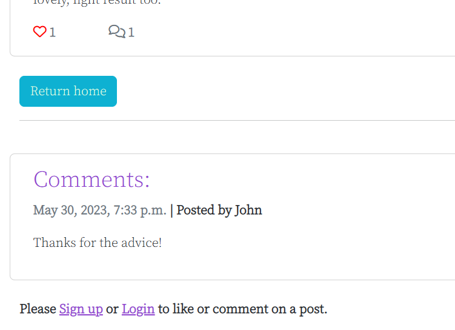

2. User input is validated if a logged in user tries to submit an empty comment they see the below message.

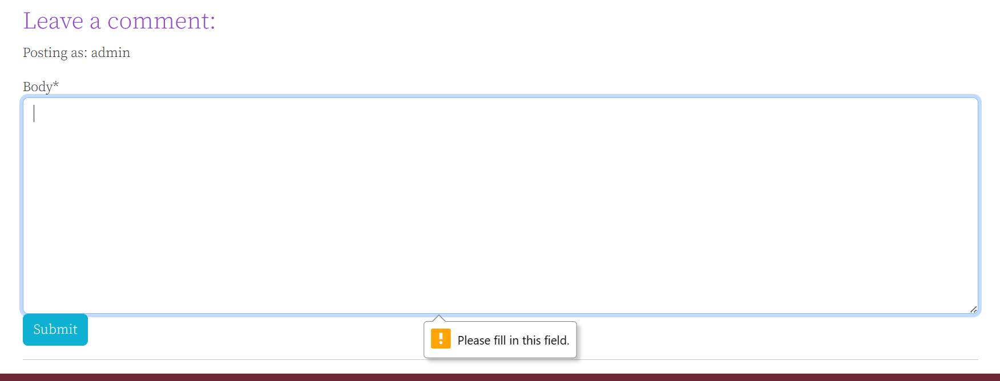

3. User input is validated when a user logs out.

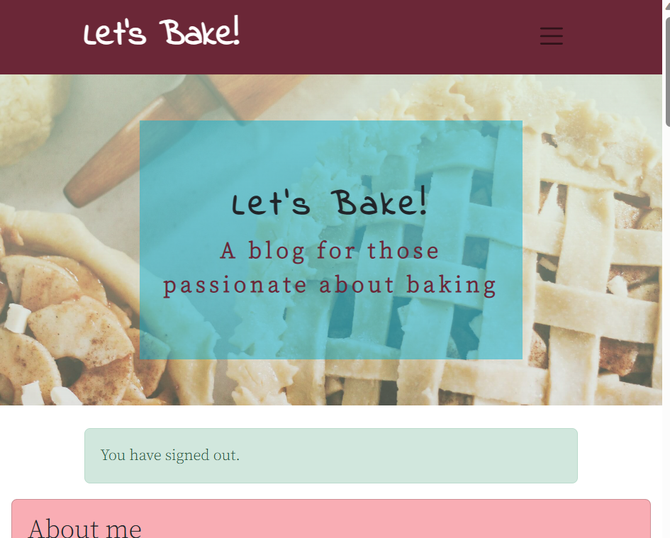

4. User input is validated when a user logs in.

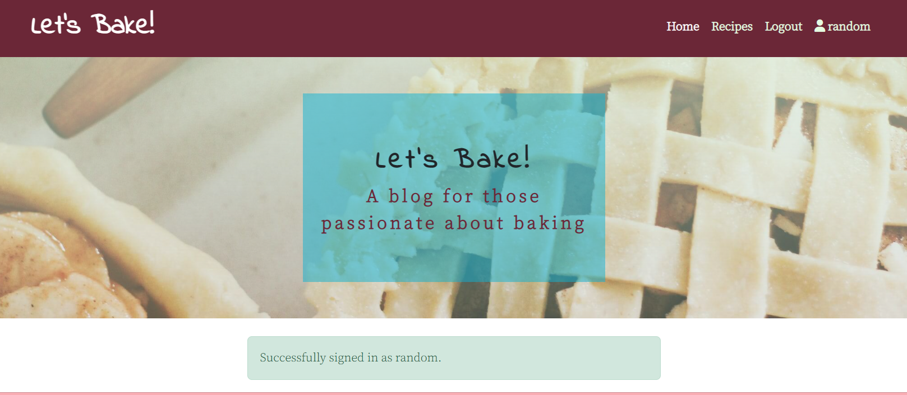

5. User input is validated when a user signs up.

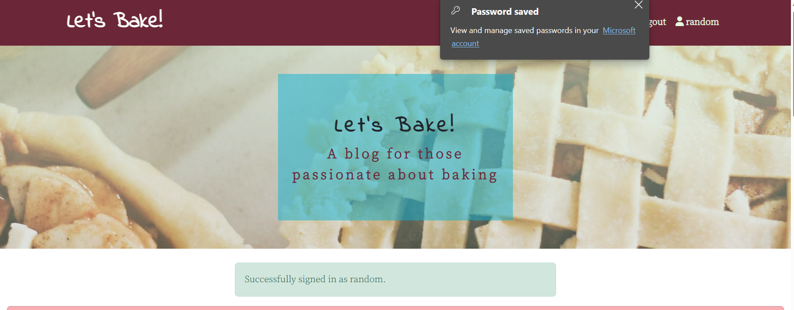

6. User input is validated when incomplete forms are submitted for login and sign up.

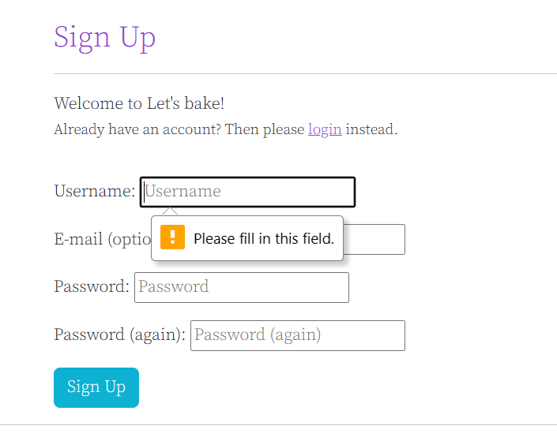

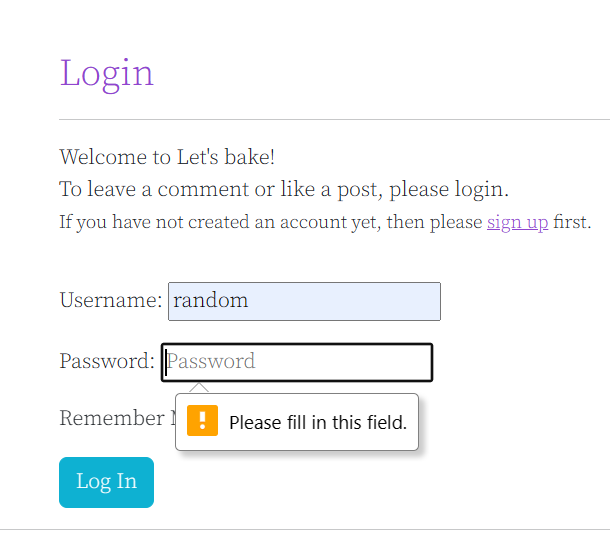

7. User input is validated when password is too common when signing up or incorrect password when logging in.

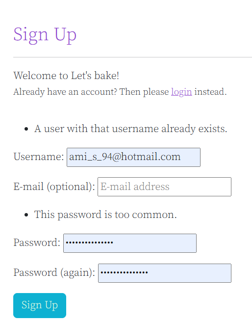

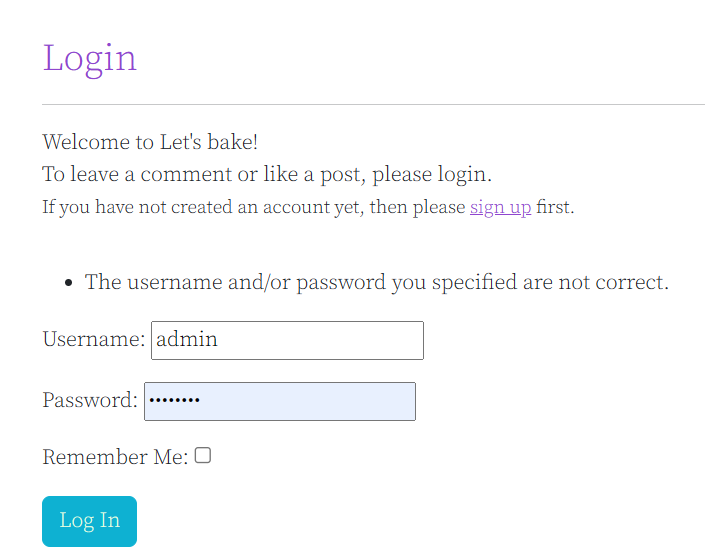

8. User input is validated when username is too short, exists already when signing up or incorrect password when logging in.

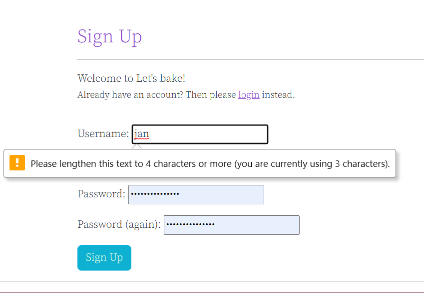

9. User input is validated when adding a recipe.

10. User input is validated when editing a recipe.

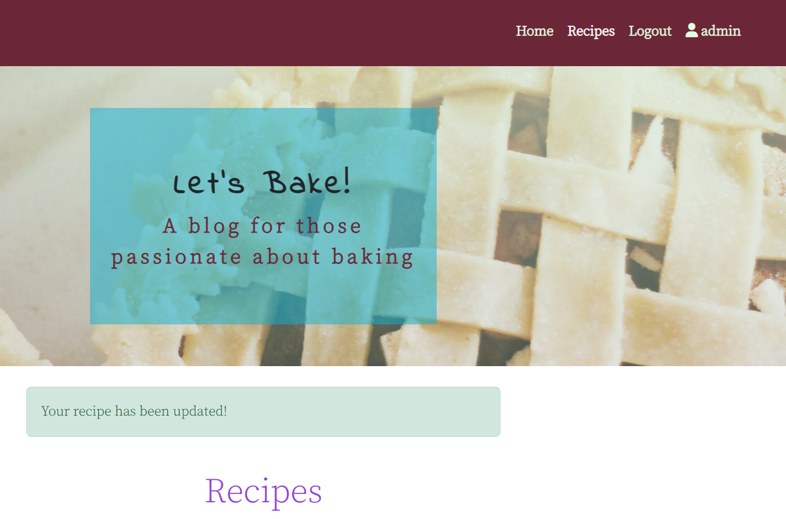

11. User input is validated when deleting a recipe.

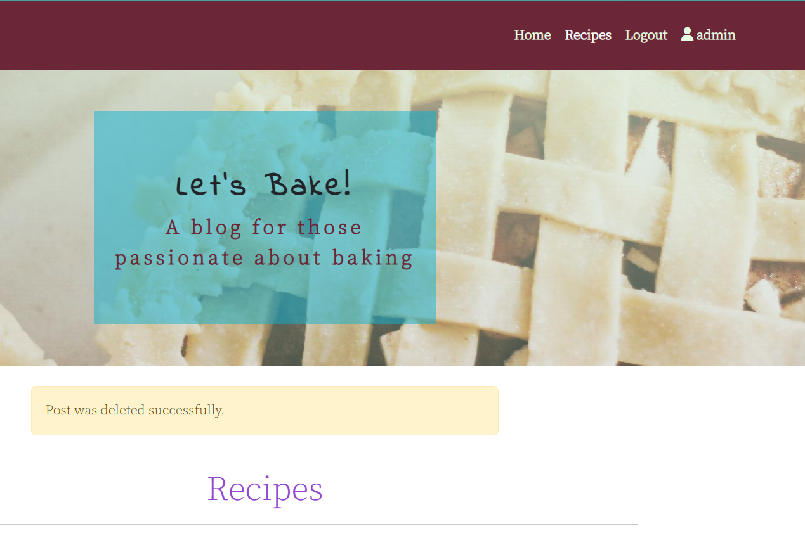

12. User input is validated when comment is awaiting approval.

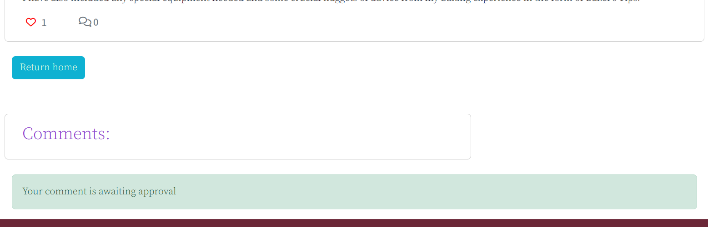

13. User input is validated when comment is liked.

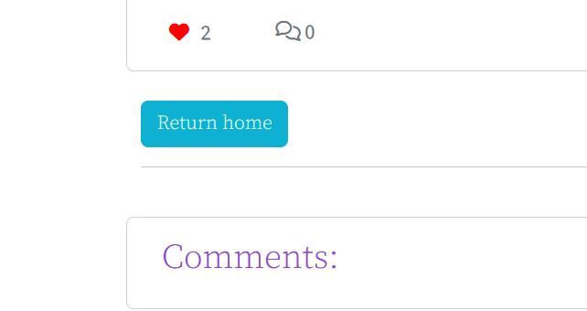

