# Let's Bake! | Testing

Return to [README](https://github.com/Sarohia94/Project-4-Baking-Blog/blob/main/README.md)

* [Issues](#Issues)
* [PEP8](#PEP8)
* [W3C Validator](#W3C-Validator)
* [Manual Testing](#Manual-Testing)
* [Accessibility](#Accessiblity)
* [Lighthouse Testing](#lighthouse-testing)
* [User Validation Testing](#User-Validation-Testing)

- - -

## Issues

### Solved Bugs

1. Bug: On mobile summernote text editor was oversplliing the add recipe form.

Solution: Found a post on slack advising to add a summernote config dictionary in the settings file which can be styled using a bootstrap theme.

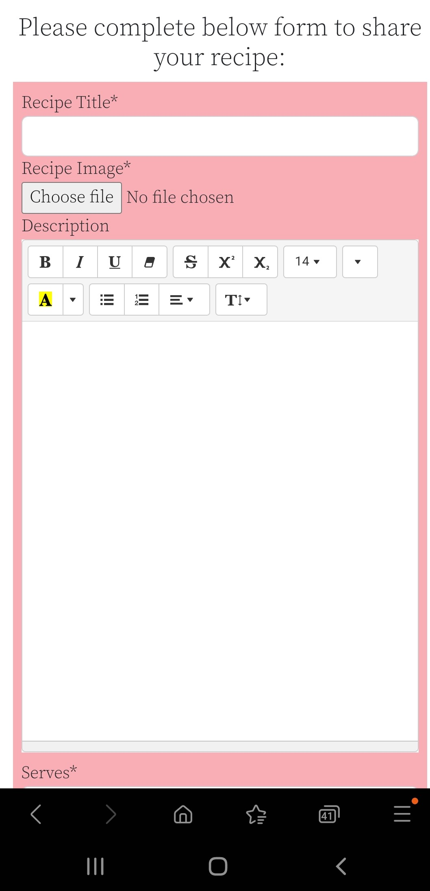

2. Bug: I had a slug error when submitting a post with the same name as another post. I wanted to account for this where unique users may submit there own recipes but with the same name then the slug field should iterate and the post should open with a unique slug. The problem was after installing autoslug and updating models when I tested this I was able to add posts with the same name but when I went to open post then I got a 505 error.

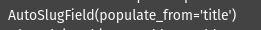

Solution: With some help from tutor support, it was identified from admin prepopulated_fields needed to be removed as autoslug does this already in the background and the title should have recipe_name in models.

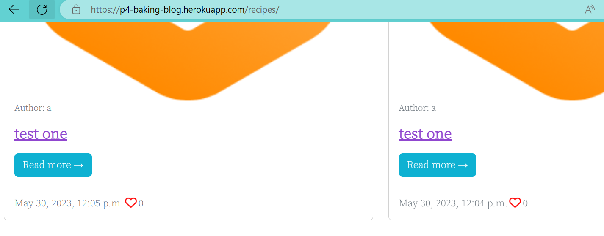

3. Bug: When first deploying to Heroku now the deployed site was not rendering the hero image. Image was called in the cloudinary images folder in CSS. Tutor support kindly identified and explained when you collect static, Cloudinary will collect all images in the static folder as well. However the image seems to be throwing a 404 on the deployed app, so we need to check this was collected correctly on Cloudinary. When comparing the cloudinary url to the css url the app seemed to have been looking for a jpeg, but Cloudinary has a jpg file.

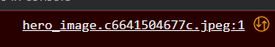

Solution: The absolute url was used in the CSS file, rather than the relative version. So, the url set by Cloudinary, rather than rendering it from the relative file path. Once added/committed/pushed this rendered ok.

4. Bug: As I was testing, adding recipes I found that suddenly when I went to click on recipes link in the navbar, I would get the below error.

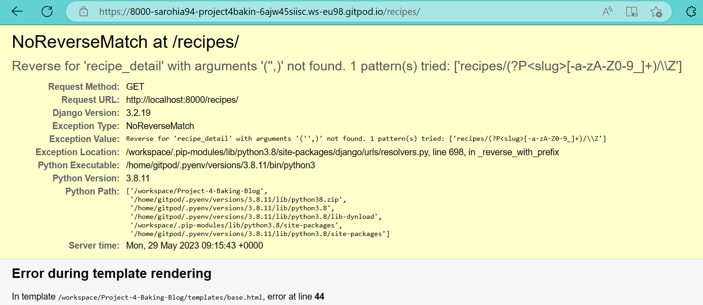

Solution: With help from tutor support it was explained we need to override the save method if there is no slug, then it should be taking the title, replacing all spaces with hyphens in order to make it url friendly. From [LearnDjango](https://learndjango.com/tutorials/django-slug-tutorial). This fixed the issue.

5. Bug: Issue with RecipeComments model, when I submit a comment I get an error message directing me to line 70 of my views.py file stating there is no recipe_comments attribute. So it seemed recipe_comments wasn't made or connected to Recipe. 

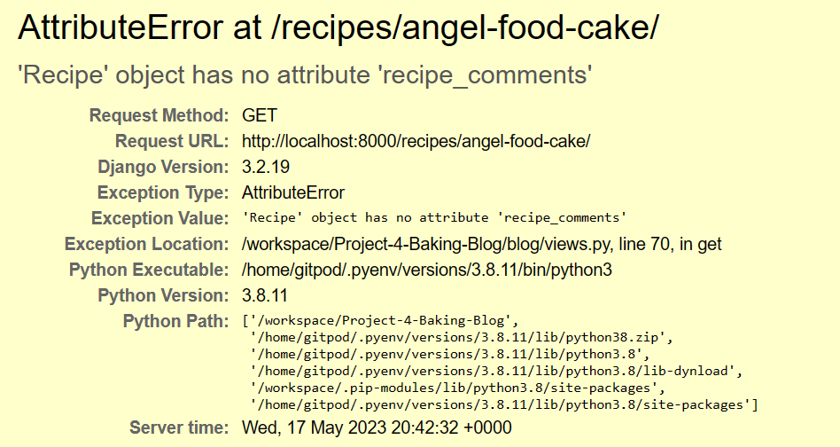

Solution: With troubleshooting help from tutorsupport it became apparent in the admin, recipe comments was being tied to the post instead, not recipes. Code was amended to fix below to refer to recipe and not post in the models and admin files. 

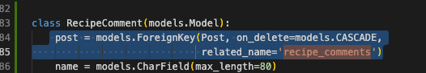

The follow up problem was when making migrations the below error was displayed. Tutorsupport advised due to the database already having existing information and we're making quite a big change here by asking recipecomment to use recipe instead of post, we would have to to wipe the previous migrations due to the conflicting information. This removed all data in the admin so certain recipes had to be redone. This was a big learning curve. 

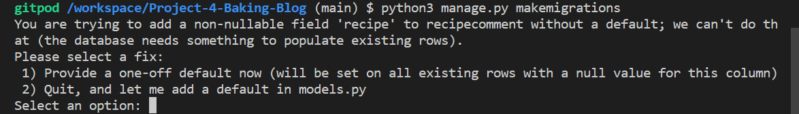

This was done by deleting all migration files (under blog directory) that start with numbers (excluding the __init__.py), then at ElephantSQL, click the Reset button on the database dashboard. After that, was able to makemigrations and migrate in the workspace again as normal and the issue was sorted. A new superuser had to be created.  

### Known Bugs

To the best of my knowledge below are the known bugs I have identified.

1. Bug: On mobiles or smaller screens the like and count comments are not displayed next to the icons but below. This does not affect functionality but its not great user experience. This picked up late so due to time contraints was unable to resolve.

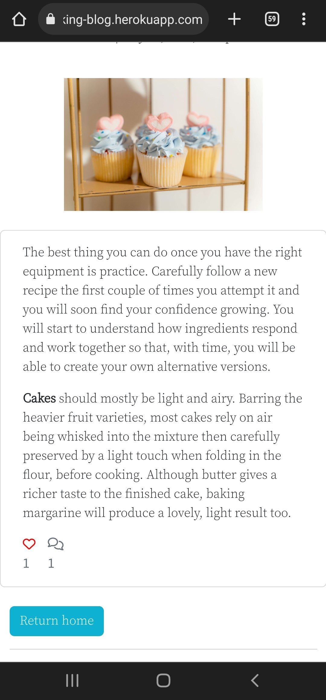

2. Bug: Image dimensions are not fixed so if different image sizes are used the cards are not uniform on larger screens. This does not affect functionality but its not the best user experience. I tried variations of setting the width and height but was unable to find a solution without compromising image quality and responsiveness on varying screen sizes.

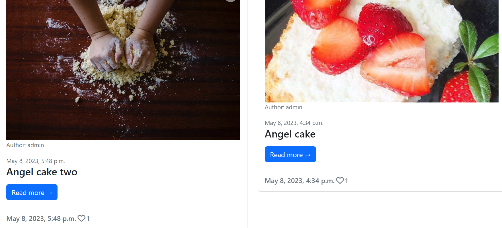

- - -

## PEP8 

Testing carried out via [PEP8 Validator](https://pep8ci.herokuapp.com/), all clear, no errors found:
* letsbake
1. [asgi.py](docs/testing/pep8/pep8_asgi.png)
2. [settings.py](docs/testing/pep8/pep8_settings.png)
3. [urls.py](docs/testing/pep8/pep8_urls.png)
4. [wsgi.py](docs/testing/pep8/pep8_wsgi.png) 

* blog
1. [admin.py](docs/testing/pep8/pep8_admin.png)
2. [apps.py](docs/testing/pep8/pep8_apps.png)
3. [forms.py](docs/testing/pep8/pep8_forms.png)
4. [models.py](docs/testing/pep8/pep8_models.png)
5. [urls.py](docs/testing/pep8/pep8_blog_urls.png)
6. [views](docs/testing/pep8/pep8_views.png)

- - -

### W3C Validator 
No issues with the HTML pages or CSS:
* [Home](docs/testing/w3c/w3c_home.png)
* [Post detail](docs/testing/w3c/w3c_post_detail.png)
* [Recipe detail](docs/testing/w3c/w3c_recipe_detail.png)
* [Recipes](docs/testing/w3c/w3c_recipes.png)
* [Sign up](docs/testing/w3c/w3c_signup.png)
* [Login](docs/testing/w3c/w3c_login.png)
* [Logout](docs/testing/w3c/w3c_logout.png)
* [User page](docs/testing/w3c/w3c_user_page.png)
* [CSS](docs/testing/w3c/w3c_css.png)

- - -

## Manual Testing

* BDD, or Behaviour Driven Development, is the process used to test user stories in a non-technical way, allowing anyone to test the features of an app. User stories as documented in the readme all pass the acceptance criteria set on the Kanban board. So this has been acheived.

* The Website was tested on Samsung internet, Google Chrome and Firefox browsers. No functionality issues were noted. 

* There were two styling issues identified following these test, a known bug and a resolved bug. Please see issues.

See below tests carried out over different browsers and devices. Responsive design was also checked throughout all stages of development using Chrome developer tools through inspect.

* Tested website on mobile with [Chrome](docs/testing/manualtesting/chrome_mobile.jpg) & [Samsung internet](docs/testing/manualtesting/samsunginternet_mobile.jpg)
* Tested on laptop with [Microsoft Edge](docs/testing/manualtesting/microsoftedge_laptop.png) and desktop with [Firefox](docs/testing/manualtesting/firefox_desktop.png).

- - -

## Accessibility

[Wave](https://wave.webaim.org/) Web Accessibility Evaluation Tools were used to test accessibility. Please see the results below for each page.

* [Home](docs/testing/wave/wave_home.png)
* [Post detail](docs/testing/wave/wave_post.png)
* [Recipe detail](docs/testing/wave/wave_recipe_post.png)
* [Recipes](docs/testing/wave/wave_recipe.png)
* [Sign up](docs/testing/wave/wave_signup.png)
* [Login](docs/testing/wave/wave_login.png)
* [User page](docs/testing/wave/wave_user_page.png)

- - -

## Lighthouse Testing
* [Home](docs/testing/lighthouse/desktop_home.png)
* [Post detail](docs/testing/lighthouse/desktop_post.png)
* [Recipe detail](docs/testing/lighthouse/desktop_recipe_post.png)
* [Recipes](docs/testing/lighthouse/desktop_recipes.png)
* [Sign up](docs/testing/lighthouse/desktop_signup.png)
* [Login](docs/testing/lighthouse/desktop_login.png)
* [Logout](docs/testing/lighthouse/desktop_logout.png)
* [User page](docs/testing/lighthouse/desktop_user_page.png)

- - -

## User Validation Testing

1. If user is not logged in they are unable to access / view "leave a comment" or like button.

2. User input is validated if a logged in user tries to submit an empty comment they see the below message.

3. User input is validated when a user logs out.

4. User input is validated when a user logs in.

5. User input is validated when a user signs up.

6. User input is validated when incomplete forms are submitted for login and sign up.

7. User input is validated when password is too common when signing up or incorrect password when logging in.

8. User input is validated when username is too short, exists already when signing up or incorrect password when logging in.

9. User input is validated when adding a recipe.

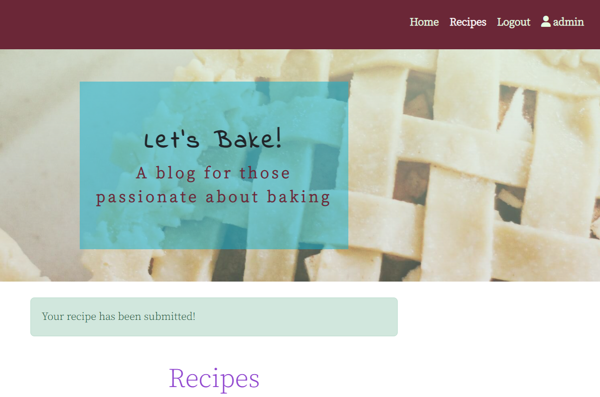

10. User input is validated when editing a recipe.

11. User input is validated when deleting a recipe.

12. User input is validated when comment is awaiting approval.

13. User input is validated when comment is liked.

